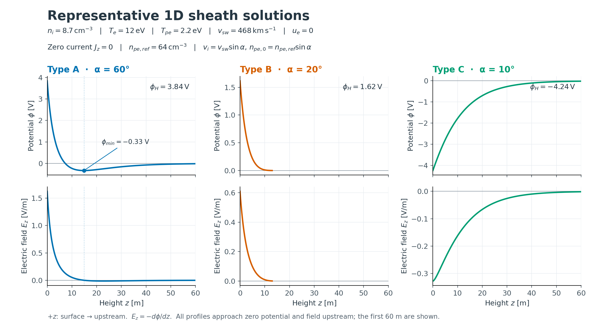
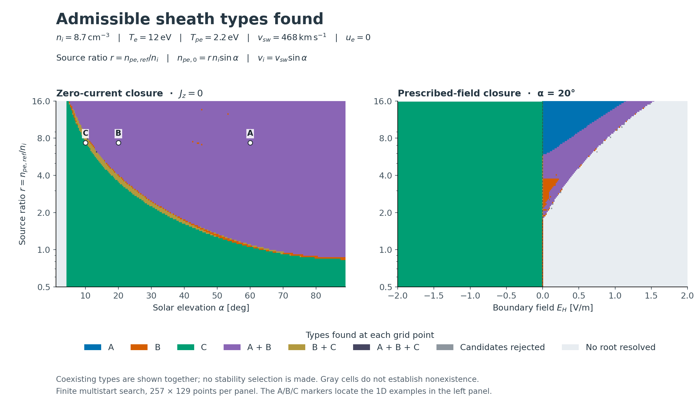

<h1 align="center">sheath-model</h1>

<p align="center">
  <strong>一次元の光電子シースを、電位・電場・粒子流束まで。</strong><br>
  Fortran / fpm &nbsp; · &nbsp; Python &nbsp; · &nbsp; Type A / B / C
</p>

<p align="center">
  <a href="#examples">計算例</a> &nbsp; / &nbsp;
  <a href="#quickstart">使い始める</a> &nbsp; / &nbsp;
  <a href="docs/fortran-api.md">Fortran API</a> &nbsp; / &nbsp;
  <a href="docs/examples.md">図とデータ</a>
</p>

Zhao 型の平面・定常光電子シースを解く、独立した Fortran ライブラリです。
**零電流条件 `J=0`** と **境界電場 `E_H` の指定**に対応し、外部ライブラリに依存せず fpm から利用できます。

<a id="examples"></a>

## 計算例

### 3 つのシース構造

太陽高度を変えたときの、Type A/B/C の電位と電場です。
いずれも **`J=0`・電子ドリフト 0** の計算で、表面から上流へ向かう最初の 60 m を表示しています。

[](docs/figures/sheath_profiles.pdf)

| Type | この例の電位の形 | 表面電位 |
| --- | --- | ---: |
| **A** · 60° | 内部に極小を持つ非単調なシース | 3.840 V |
| **B** · 20° | 正電位から上流へ単調に減少 | 1.616 V |
| **C** · 10° | 負電位から上流へ単調に増加 | −4.238 V |

Type A の極小電位は −0.332 V です。A は負の表面電位を持つ場合もあります。

[PDF](docs/figures/sheath_profiles.pdf) · [計算条件とプロファイルデータ](docs/examples.md#profiles)

### 解の Type マップ

太陽高度または指定電場と、光電子源の強さを変えたときに見つかった Type を示します。
**左は `J=0`、右は `E_H` 指定**。電子ドリフトは 0、各パネルは **257 × 129 点**の計算です。

[](docs/figures/sheath_type_maps.pdf)

**A+B などの色は、同じ条件で複数の Type が見つかったことを表します。** 安定性による選択はしていません。
灰色は候補の物理条件による棄却、薄灰色は採用解のない未解決点です。色付きの点にも未解決の枝があり、解の不存在や全根の発見を保証する図ではありません。
左の A/B/C マーカーは上のプロファイル例の位置です。

[PDF](docs/figures/sheath_type_maps.pdf) · [J=0 データ](docs/figures/data/equilibrium_map.csv) · [E_H 指定データ](docs/figures/data/field_map.csv) · [条件・凡例・再生成手順](docs/examples.md#maps)

<a id="quickstart"></a>

## 使い始める

### Fortran / fpm

Fortran 2008 対応コンパイラと fpm を用意すると、2 つのモデルを比較する例を実行できます。

```bash
git clone https://github.com/Nkzono99/sheath-model.git
cd sheath-model
fpm run --example compare_closures
```

自分の fpm プロジェクトから使う場合は、`fpm.toml` に依存を追加します。

```toml
[dependencies]
sheath-model = { git = "https://github.com/Nkzono99/sheath-model.git", branch = "main" }
```

> 掲載例は `main` の実装に対応します。公開済みの `v0.1.0` には軌道保存・物理解判定の修正が含まれません。計算の再現性が必要な場合は `branch` を使用するコミットの `rev` に置き換えてください。

**Type A の零電流解を求める最小例。** アプリ用 fpm プロジェクトの `app/main.f90` に保存し、`fpm run` で実行します。
太陽高度と電子ドリフトを明示し、その他の入力は上のプロファイル例と同じ既定値を使います。

```fortran
program sheath_example
  use sheath_model
  implicit none
  type(zhao_equilibrium_input) :: input
  type(zhao_equilibrium_result) :: solution
  integer(i32) :: status
  character(len=256) :: message

  input%branch = 'A'
  input%sun_elevation_deg = 60.0_dp
  input%electron_drift_mode = 'zero'
  call solve_equilibrium(input, solution, status, message)
  if (status /= SHEATH_OK) then
    print *, trim(message)
    stop 1
  end if

  print '(a,f8.3)', 'Surface potential [V]: ', solution%surface_potential_v
  print '(a,es12.4)', 'Current [A/m^2]: ', solution%net_current_a_m2
end program sheath_example
```

表面電位は約 **3.840 V**、正味電流は数値誤差の範囲で 0 になります。

| 求めたいもの | 公開 API | 入力 → 出力 |
| --- | --- | --- |
| 零電流の定常解 | `solve_equilibrium` | 太陽高度・プラズマ・光電子源 → 電位・密度・流束 |
| 指定電場への応答 | `solve_prescribed_field` | 法線電場・プラズマ・光電子源 → 電位・密度・流束・電流 |
| J=0 の空間分布 | `solve_profile` | 定常解の入力・積分設定 → 高さ・電位・電場・密度 |

単位は **SI、温度のみ eV**。初期化は不要で、入力型を渡して結果型とステータスを受け取ります。
両モデルとも背景電子 Maxwell 分布の規格化を未知量として解きます。
`E_H` 指定時の候補列挙・複数解の扱いは [Fortran API](docs/fortran-api.md)、
2 つのモデルの呼び出し例は [compare_closures.f90](example/compare_closures.f90) を参照してください。

### Python

Python 3.10+ では NumPy / SciPy による独立した実装も利用できます。
リポジトリ直下で `python -m pip install -e '.[plot]'` を実行してください。

```python
from sheath_model import ZhaoParams, ZhaoSheathSolver

solver = ZhaoSheathSolver(
    ZhaoParams(alpha_deg=60.0, electron_drift_mode="zero", zmax_hat=120.0)
)
profile = solver.solve_profile("A")
print(profile["phi0_V"], profile["phi_m_V"])
```

`python examples/plot_profiles.py` でプロファイルを描画できます。
Fortran とのバインディングはなく、局所流束・速度分布の診断にも同じ軌道分布を使います。

## さらに詳しく

| ドキュメント | 内容 |
| --- | --- |
| [図と計算例](docs/examples.md) | 図の条件、CSV / PDF、再生成手順、実行例 |
| [Fortran API](docs/fortran-api.md) | 入出力・単位・既定値・探索診断・近隣解の利用 |
| [運動論モデル](docs/kinetic-model.md) | 軌道保存、半無限上流条件、解の採用条件 |
| [Algorithm notes](docs/algorithm.md) | Python モデルの式と数値解法 |

図の A/C は無ドリフト電子の例です。正の内向き電子ドリフトと完全反射を仮定した A/C は、
このモデルの半無限上流条件に接続できません。詳細は [運動論モデル](docs/kinetic-model.md) に記載しています。

## 開発時の整形

Fortran は [fprettify](https://github.com/fortran-lang/fprettify/tree/v0.3.7) で空白を整え、
[findent](https://pypi.org/project/findent/4.3.6/) で submodule を含む構文の字下げを統一し、
[pre-commit](https://pre-commit.com/) でコミット時に自動整形します。
リポジトリ直下で一度設定してください。

```bash
python -m pip install -e '.[dev]'
pre-commit install
pre-commit run --all-files
```

対象は `src/`・`test/`・`example/` の `.f90`、インデントは2文字、行長の目安は132文字です。
整形で変更されたファイルは確認して再度 stage し、コミットします。
`build/` の生成物と `outputs/` の検証用 snapshot は対象外です。

汎用数値処理は [sheath_model_numerics.f90](src/internal/sheath_model_numerics.f90)、
大文字表記のステータス定数は [sheath_model_status.f90](src/internal/sheath_model_status.f90) にまとめています。
物理残差・枝の初期値・解の採用条件はシースモデル側が担当します。
submodule の実装も `module subroutine 名前(引数...)` と書き、引数の型と `intent` を明示します。

## ライセンス

Python 実装と新規の公開窓口は **MIT**、BEACH のシース数値実装から抽出した部分は **Apache-2.0** です。
出典は [NOTICE](NOTICE)、ライセンス本文は [LICENSE](LICENSE) / [Apache-2.0](LICENSES/Apache-2.0.txt) を参照してください。
