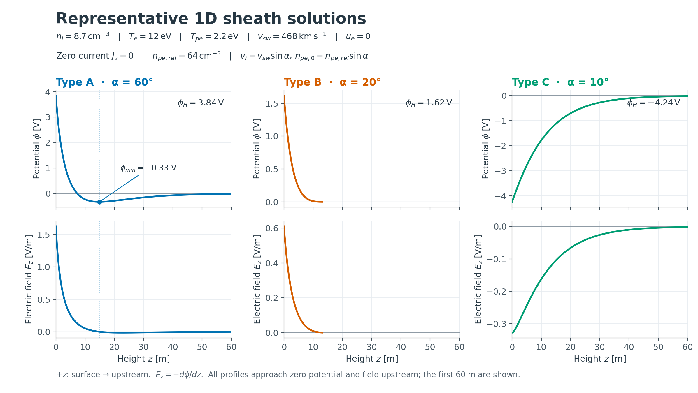
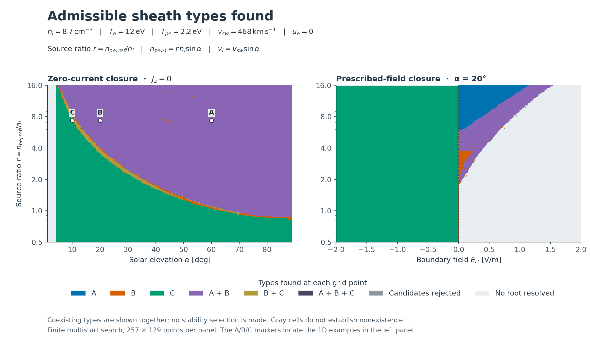

# sheath-model

平面・定常の一次元光電子シースを解き、電位・電場・粒子流束を求める独立したライブラリです。
Fortran / fpm は零電流条件 `J=0`、境界電場 `E_H` の指定、任意光電子スペクトルに対応します。
Python は Maxwell 光電子源の `J=0` モデルに対応します。

## 計算例

### Type A/B/C のプロファイル

太陽高度を変えたときの電位と電場です。`J=0`・電子ドリフト 0、表面から最初の 60 m を表示しています。

[](docs/figures/sheath_profiles.pdf)

[計算条件・CSV データ](docs/examples.md#profiles)（画像をクリックすると PDF）

### 解の Type マップ

左は `J=0`、右は `E_H` 指定で見つかった解の Type です。いずれも電子ドリフト 0 です。

[](docs/figures/sheath_type_maps.pdf)

複数 Type の表示は安定性による選択を意味しません。灰色領域も含め、解の不存在や全根の発見は保証しません。
[計算条件・凡例・CSV データ](docs/examples.md#maps)（画像をクリックすると PDF）

## 使い始める

リポジトリ直下で実行します。

**Fortran 2008 対応コンパイラ + fpm**

```bash
fpm run --example compare_closures
```

**Python 3.10+**

```bash
python -m pip install -e '.[plot]'
python examples/plot_profiles.py
```

依存の追加方法や呼び出し例は [図と計算例](docs/examples.md#その他の実行例) を参照してください。

## ドキュメント

- [図の再生成・実行例](docs/examples.md)
- [Fortran API](docs/fortran-api.md) / [スペクトルと静的評価 API](docs/spectral-api.md)
- [モデルの仮定](docs/kinetic-model.md) / [数値計算法](docs/algorithm.md)

## ライセンス

Python 実装と新規の公開窓口は [MIT](LICENSE)、BEACH 由来の数値実装は [Apache-2.0](LICENSES/Apache-2.0.txt) です。出典は [NOTICE](NOTICE) を参照してください。
