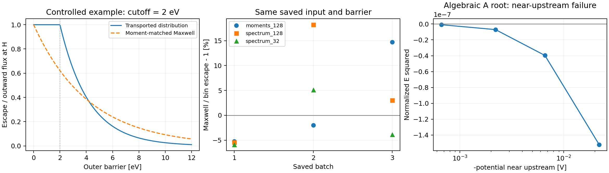
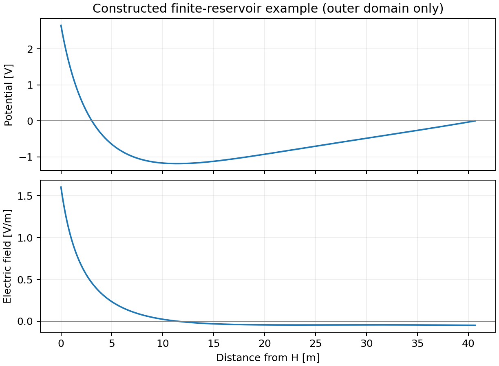

# Matching plane の物理モデル検証（2026-09-23）

内部電子・内側の体積空間電荷の導入は対象外とした。BEACH / sheath-model の本体コードは変更していない。

**結論：H に到達した outward 流束を入力する定義は整合的であり、H より内側で戻った電子を入力へ足し戻す修正は支持されない。検討すべき点は H のエネルギー分布近似と外側の境界条件である。ただし、今回の検証だけで過去の BEACH の解範囲外イベントの原因や、採用する新モデルを確定したわけではない。**

## 1. 内側 return と H 入力

定常・平面・無衝突、途中の粒子生成や横方向損失がない場合、流束の収支は

\[
\Gamma_s-\Gamma_{\mathrm{return,inner}}
=\Gamma_H^+,
\qquad
\Gamma_H^+-\Gamma_{\mathrm{return,outer}}
=\Gamma_{\mathrm{escape}}.
\]

H より内側の return は既に \(\Gamma_H^+\) から除かれている。外側モデルが返す return は H を外向きに通過した後に戻る成分であり、両者の担当領域が異なる。実際の結合で net 流束ではなく **outward 成分とその分布**を渡すことが前提になる。

表面から H まで電位が単調に下がる減速場では、表面の half-Maxwell 分布を軌道に沿って輸送しても H では同じ温度の half-Maxwell になる。変わるのは流束の規格化である。温度を eV、電位を V で表すと

\[
\Gamma_H^+=\Gamma_s\exp[-(\phi_s-\phi_H)/T_{\mathrm{pe}}],
\quad
\Gamma_{\mathrm{escape}}
=\Gamma_H^+\exp[-(\phi_H-\phi_{m,\mathrm{outer}})/T_{\mathrm{pe}}].
\]

同じ経路上で H の位置を動かしても、積は変わらない。4 種の電位原点 × 5 種の減速幅、計 20 条件を独立な速度積分で確認した。

一方、加速場や内側の電位極小を通過すると、H の法線運動エネルギー分布に下限 \(K_c>0\) が生じ得る。輸送された Maxwell 起源の分布では、外側障壁 B に対して

\[
P_{\mathrm{escape}}=\exp[-\max(0,B-K_c)/T_{\mathrm{pe}}].
\]

流束と平均法線エネルギーを合わせた単一 Maxwell は、これを
\(\exp[-B/(T_{\mathrm{pe}}+K_c)]\) で近似する。この例では障壁が平均エネルギーより低いと過小評価、高いと過大評価になる。4 種の加速・極小条件 × 8 障壁、計 32 条件で符号の反転を確認した。52 条件を通じた保存則・写像の最大 scaled error は **4.44e-16**。

したがって、一般の分布に対して放出量の規格化だけを増やす補正は適切でない。H で測った分布を外側の密度・return・escape に一貫して用いる方針に根拠がある。

## 2. 保存済み BEACH 分布での比較

`sheath_pe_spectrum_implementation_20260922` の `moments_128`, `spectrum_128`, `spectrum_32` 各 3 batch、計 9 状態を利用した。**各状態の同じ入力分布・同じ記録済み障壁**で、moment Maxwell の escape と保存 bin 表現の積分を比較した。

\[
\Gamma_{\mathrm{Maxwell}}/\Gamma_{\mathrm{bin}}-1
=\mathbf{-5.89\%\ \text{〜}\ +18.21\%}.
\]

これは物理的真値への誤差ではない。bin 幅、Monte Carlo 標本、局所的な交差電位と平均面電位の違いが残る。別々に発展した run を同一状態とみなした比較でもなく、統計的有意差や系統的な過小評価を示すものでもない。

結果： [保存分布比較 CSV](validation/pe_transport_saved_spectra.csv)、[検証 JSON](validation/pe_transport_validation.json)。元の 6 CSV は `raw_inputs/` に複製し、元ファイルの SHA-256 は JSON に記録した。

## 3. 正の電子ドリフトと厳密な無限遠条件

入射 shifted Maxwell、低速電子の完全反射、無衝突、無限遠で電荷中性かつ E=0、という組合せを調べた。ドリフト u は内向き速度を正とし、電子熱速度で規格化する。A の上流側と C に共通する反射集団では、\(\psi=e\phi/T_e=-h\), \(h\to0^+\) に対して

\[
\frac{n_e(-h)-n_e(0)}{N_e}
=\frac{u e^{-u^2}}{\sqrt{\pi}}h\log(1/h)+O(h).
\]

u=0, 0.05, 0.2, 0.213272、h=1e-3〜1e-12 の独立積分で、対数項係数の最大絶対誤差は **1.48e-11**。速度分布の独立積分と現行 Python 密度の最大差は **1.58e-12**（規格化密度）。正の u で増えるこの電子密度項は、通常のイオン・逃走 PE の O(h) 応答より支配的になり、厳密な無限遠条件から積分した E² を負にする。

さらに、実装の棄却条件を使わず、旧来の A の代数条件を独立に解いた。

| 量 | 値 |
|---|---:|
| \(\phi_H\) | 2.65442681394 V |
| \(\phi_m\) | −1.18972381159 V |
| 入射分布の規格化 \(N_e\) | 7.92326855825e6 m⁻³ |
| 規格化代数残差の最大値 | 4.17e-17 |
| \(\phi=-0.022\) V での独立積分 E² | **−3.87e-7 V²/m²** |

代数根があっても実数の空間プロファイルにならない代表例を再現した。これは「内側 return が不足している」という説明では解消しない。A/C 一般の可否は上記の分布・境界条件に限定した議論であり、任意のプラズマ分布や有限境界の A 型形状を禁止する主張ではない。

結果： [漸近係数 CSV](validation/upstream_hlog_asymptotic.csv)、[独立 E² 積分 CSV](validation/upstream_algebraic_root_field_integral.csv)、[検証 JSON](validation/upstream_validation.json)。



## 4. 有限距離の上流境界という別の問題

H≤z≤L に限り、L で入射電子分布と冷たい入射イオンを指定し、\(\phi(L)=0\) とした。L の電場・電荷中性・零電流は課さず、流出粒子は外部 reservoir に吸収される。内部電子は追加していない。

上記の A 代数根を出発点に、入射電子の規格化を 1% 増やして電位両端から EH と長さを構成した。その後、**Ne・EH・長さを固定した逆問題**を、ずらした初期値から解き直した。

| 量 | 構成例 |
|---|---:|
| 電子ドリフト u | 0.1972696004 |
| 固定した入射電子規格化 \(N_e\) | 8.00250124383e6 m⁻³ |
| \(E_H\) | 1.60365989720 V/m |
| L−H | 40.6777071792 m |
| \(\phi_H,\phi_m\) | 2.65442681394, −1.18972381159 V |
| 出力 \(E_L\) | **−0.0492870340 V/m** |
| 出力 \(\rho_L\) | −9.97514e-15 C/m³ |

128→256→512→1024 分割で確認し、最後の倍密度化による相対変化は、長さ **2.19e-8**、EH **2.85e-11**、EL **6.65e-7**。独立な適応積分でも E² を照合した。逆問題での EH²・長さの規格化残差は、それぞれ −9.69e-10、−1.95e-7 だった。

**有限境界なら正ドリフトの電位極小を持つ静的応答を作れる、という構成例である。** BEACH の測定値に合わせた結果ではなく、L と Ne の物理的選定、浮遊零電流平衡、動的安定性、無限領域への収束は未検証。この例だけを根拠に現在のモデルを置換できるとは判断しない。

結果： [検証 JSON](validation/finite_reservoir_validation.json)、[分割数収束 CSV](validation/finite_reservoir_convergence.csv)、[プロファイル CSV](validation/finite_reservoir_profile.csv)。



## 5. 現行実装の検証と残った問題

現行ソースの Fortran テスト **4 プログラム**、Python テスト **13 件**は通過した。公開 prescribed-field API から得た **10 根**を独立な速度・電位積分で照合した。

- 最大規格化中性残差：6.08e-13。
- 最大 E² 誤差 `abs(ΔE²)/max(1, EH²)`：1.99e-13。
- 最大相対流束保存誤差：4.75e-16。
- 各根の経路上 24 または 48 標本点で、E² の非負性を数値許容誤差内で確認した。最大の微小負値は約 −7e-15 V²/m² で、積分丸め誤差の範囲。連続区間の全点や任意パラメータに対する存在証明ではない。

現行 prescribed-field closure は Ne を中性条件から調整する問題で、固定された外部 reservoir の応答とは異なる。同じ他パラメータで EH=1.4→1.6 V/m とすると、A 根の Ne は 7.0046e6→9.4289e6 m⁻³、B 根は 1.9817e6→8.5823e6 m⁻³ に変わった。BEACH が固定された入射プラズマを想定する場合、この自由度の扱いを物理的に決める必要がある。

**未解決：** EH=1.8 V/m の 2 条件は有限 multistart 探索で非収束（status=3）。物理的不存在と判断していない。過去の BEACH の解範囲外イベントそのものを再現・原因確定する試験も実施していない。

結果： [根の独立監査 JSON](validation/field_audit.json)、[根 CSV](validation/field_roots.csv)、[探索 status CSV](validation/field_status.csv)。

## 6. 実行記録と再現

検証用 snapshot の元ソースは sheath-model commit `22bab2be1d1f84320893395bdb46b71a5053d5da`。実際に使ったソース・検証スクリプトを `snapshot/` に保存した。IDE の `build/release-consumer/build/dependencies/sheath-model` は旧 v0.1.0 の生成済み依存コピーであり、今回の検証対象ではない。

RunHand scratch: `/home/b/b36291/.cache/runhand/scratch/tasks/analysis/task-f8f98afe1dbd434c891077aad4320b93`。

すべてのビルド・テスト・数値計算・描画は KUDPC SysG の計算ノードで実行した。

| Slurm Job | 結果 | 内容 |
|---|---|---|
| 297799 | FAILED 1:0 | 初回の Python 環境に SciPy がなく、テスト前に終了 |
| 297800 | COMPLETED 0:0 | 環境変更後、Fortran/Python テスト・候補探索・独立積分 |
| 297805 | COMPLETED 0:0 | 経路標本の E² 確認・有限 reservoir・図 |
| 297807 | COMPLETED 0:0 | 負 E² が見えるよう図の表示範囲だけ調整 |

環境情報・テストログ・[Slurm 記録](validation/slurm_accounting.txt)を `validation/` に保存した。使用 Python は `/LARGE0/gr20001/b36291/Github/DRIFT/.venv/bin/python`。本体のコード変更はなく、snapshot に検証専用 example を追加して実行した。

再実行する場合は `snapshot/` を作業コピーにし、計算ノード上で以下を実行する。Python 環境には NumPy / SciPy / Matplotlib が必要。`raw_inputs/` への相対パスを保つこと。

```bash
mkdir -p validation
export PYTHONPATH="$PWD"
export OPENBLAS_NUM_THREADS=1 OMP_NUM_THREADS=1 OMP_PROC_BIND=false
PY=/LARGE0/gr20001/b36291/Github/DRIFT/.venv/bin/python
fpm test --compiler gfortran --profile release --flag '-ffree-line-length-none'
"$PY" -m unittest discover -s tests -v
fpm run --example validation_probe --compiler gfortran --profile release --flag '-ffree-line-length-none'
"$PY" verify_field_roots.py
"$PY" verify_pe_transport.py --archive ../raw_inputs
"$PY" verify_upstream.py
"$PY" verify_finite_reservoir.py
"$PY" plot_validation.py
```

保存した `run_*checks.sh` は実行時の scratch 絶対パスを含む原記録。移動後の再現には上記コマンドを使う。`validation/source_hashes.txt` は `snapshot/` を基準とする最終ファイルハッシュで、描画範囲変更前の記録は `source_hashes_before_plot.txt` として残した。
